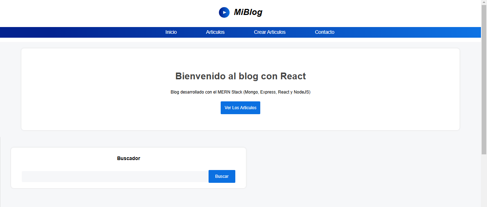
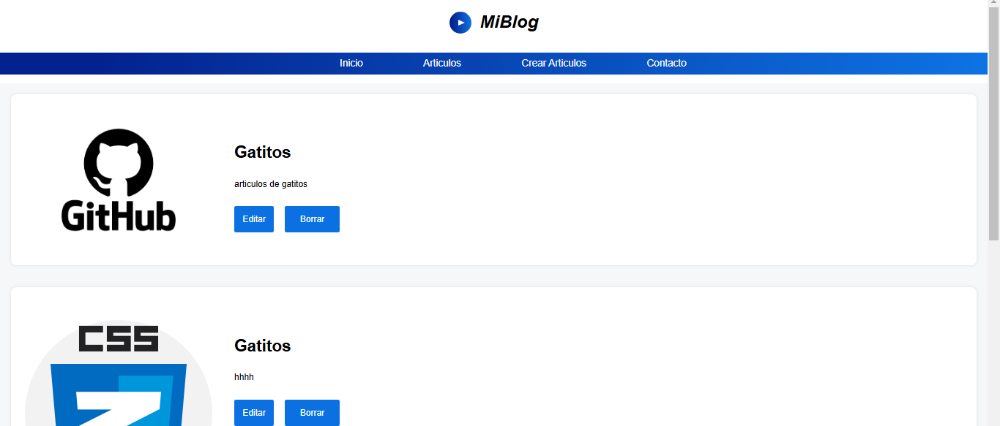
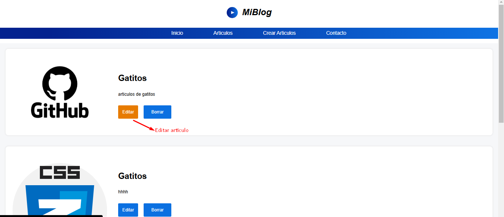
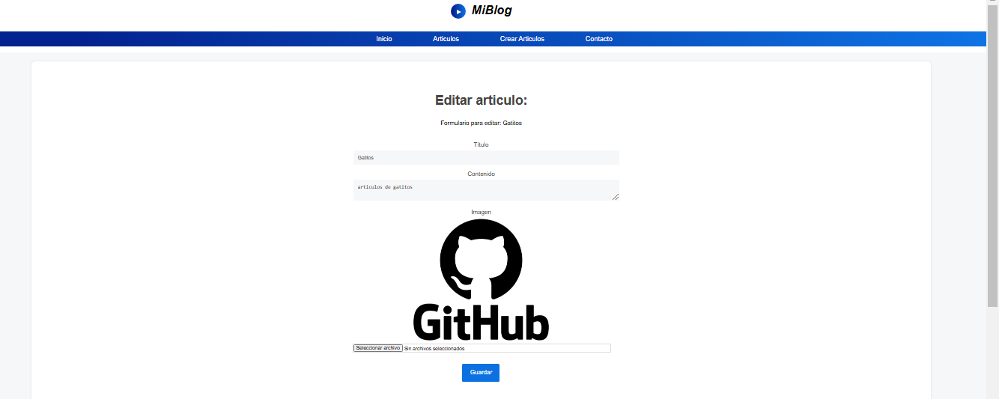
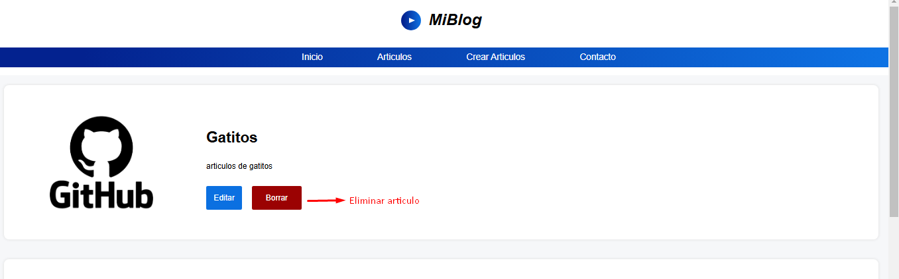

# Red Social-Frontend 👥

El frontend de esta página web fue desarrollado con React y optimizado con Vite para un mejor rendimiento. La aplicación permite la gestión de artículos mediante formularios y peticiones AJAX.

## Tabla de Contenidos

- [Características](#caracteristicas)
- [Tecnologías](#tecnologias)
- [Instalación](#instalacion)
- [Interfaz](#interfaz)
- [Despliegue](#despliegue)
- [Contacto](#contacto)

## Características 💬 <a id="caracteristicas"></a>

- **Interfaz rápida y optimizada:** Desarrollada con Vite para un mejor rendimiento.

- **Navegación dinámica:** Implementada con React Router DOM para una experiencia fluida entre páginas.

- **Gestión de artículos:** Permite crear, editar, eliminar y visualizar artículos de manera sencilla.

- **Subida de imágenes:** Funcionalidad para adjuntar imágenes a los artículos con React.

- **Conexión con el backend:** Uso de Fetch para realizar peticiones AJAX y manejar datos.

- **Uso de setTimeout:** Aplicado en ciertas interacciones para mejorar la UX.

- **Formularios interactivos:** Recoge y procesa datos de los usuarios de forma dinámica.

- **URL global centralizada:** Facilita la gestión de rutas y endpoints de la API.

- **Optimización y escalabilidad:** Código modular con helpers reutilizables.

## Tecnologías 🌐 <a id="tecnologias"></a>

- **Vite**: Entorno de desarrollo rápido y ligero para React.

- **React**: Biblioteca principal para la creación de la interfaz de usuario.

- **React Router DOM**: Sistema de navegación para gestionar rutas en la aplicación.

## Instalación ⚙️ <a id="instalacion"></a>

Antes de instalar, descargue e instale Node.js. ☑️

1. Clona el repositorio:

```bash
  git clone https://github.com/freya-godoy/Red-Social-Backend.git
```

2. Instala dependencias del proyecto:

```sh
npm install
```

3. Iniciar el servidor de desarrollo:

```sh
npm run dev
```

Esta plantilla proporciona una configuración mínima para que React funcione en Vite con HMR y algunas reglas de ESLint. ☑️

- [@vitejs/plugin-react](https://github.com/vitejs/vite-plugin-react/blob/main/packages/plugin-react/README.md) uses [Babel](https://babeljs.io/) for Fast Refresh
- [@vitejs/plugin-react-swc](https://github.com/vitejs/vite-plugin-react-swc) uses [SWC](https://swc.rs/) for Fast Refresh

## Interfaz 📲 <a id="interfaz"></a>

Inicio del blog 📰



Articulos 📄



Editar articulo 📝





Eliminar articulo 🚮



## Despliegue 📂 <a id="despliegue"></a>

Despliegue desde la consola:

Backend

```sh
npm start
```

Frontend

```sh
npm run dev
```

## Contribuciones 👇

¡Las contribuciones son bienvenidas! Sigue estos pasos:

1. Haz un fork del repositorio.
2. Crea una rama nueva: `git checkout -b nueva-rama`
3. Realiza tus cambios y haz un commit: `git commit -m "Descripción"`
4. Sube los cambios: `git push origin nueva-rama`
5. Abre un Pull Request.

## Contacto 📬 <a id="contacto"></a>

- Email: freya.godoy.20@hotmail.com
